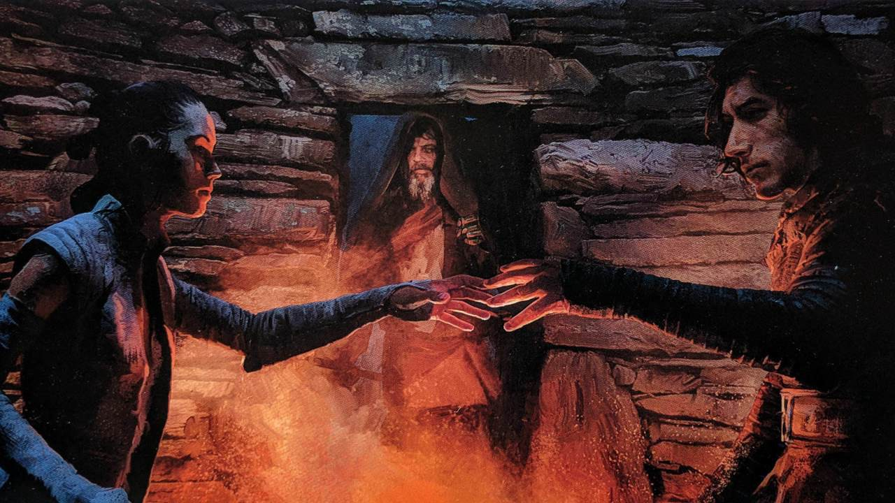
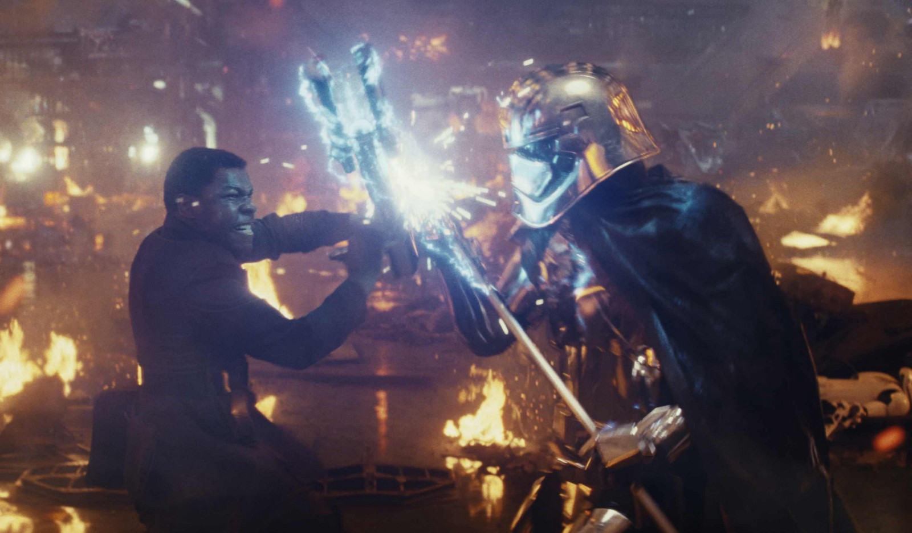
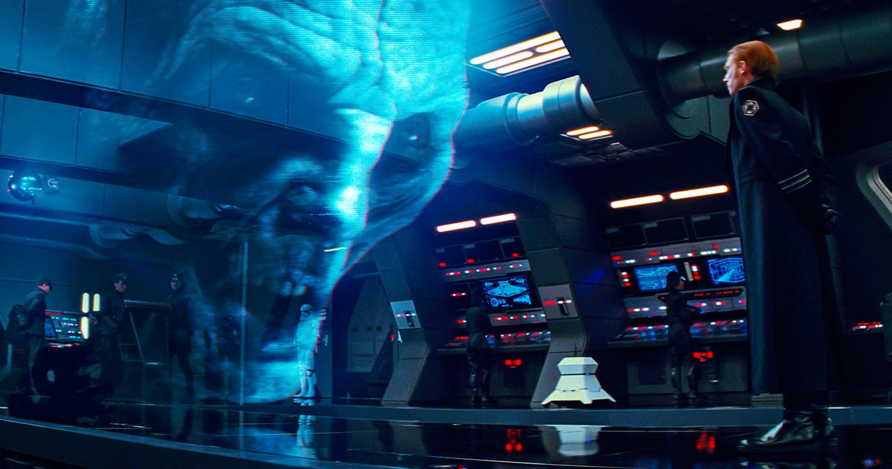
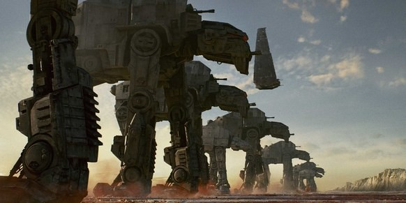
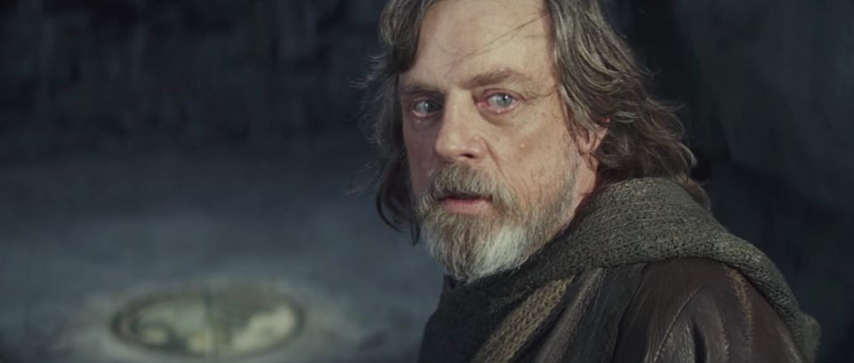

В связи с недавним релизом свежего эпизода ЗВ выкатываю Неуютный Обзор.

](./asset-1.jpeg)

Чтож. Скажу сразу: в целом, это хорошие Звездные Войны, но не для фанатов. Для этого есть куча причин, которые я описывал без спойлеров [туть](http://telegra.ph/tukejsemnadtcat-12-30). Тут же я наиболее полностно опишу вам, почему Дисней это плохо для фанатов ЗВ.

#### Начнем с плохого

Разговоры о балансе силы, что джедаи, ситы, Сопротивление и Первый Порядок должны исчезнуть и больше не будет явного разделения на чёрное и белое. На протяжении полутора часов фильма говорят об этом. И это круто, это действительно то, что нужно киновселенной ЗВ. Но в оставшейся трети фильма снова возвращают это деление и я остался в недоумении: зачем задвигать такую тему, если она не используется и не собирается, судя по финалу. В этом видится только одно — влияние Диснея. Стоит помнить, что ЗВ это детская сказка, где существует явное деление на добро и зло, где добро всегда побеждает и все такое. Дисней боится потерять солидный кусок аудитории, это можно понять, но тогда они могли бы изначально повлиять на сценарий и не внедрять всю эту залупу про баланс.

Следующий момент это абсолютно вся сюжетная ветка Финна и Роуз (это негр и азиатка, если что). Без их ветки сюжет пришел бы к тому же результату, Холдо разхерачила бы флагман Сноука, ребел скам попал бы на Крайт и спасся благодаря Рей. Сама по себе ветка унылая, опять же задвигающая тему про то, что нет плохо и хорошо (когда персонаж Гильермо дель Торо показывает Финну на чем разбогател владелец угнанного корабля). Абсолютно бесполезная трата времени зрителя. Ну и завершение их ветки, когда Финн героически хотел пожертвовать собой и раздербанить полевую Звезду Смерти (я готов был ликовать от его смерти ибо персонаж показал свою бесполезность), но в последний момент его спасает Роуз и возникает вопрос: зачем? В смысле вообще, чувак был готов пожертвовать жизнью чтобы спасти эту вашу искру Сопротивления, но эта Роуз берет и врезается в него, спасая его и подвергая себя опастности. Глупо.

Третьим пунктом стоит смерть Сноука. Да, я в курсе кучи абсурдных теорий от фанатов, но давайте их откинем и подумаем. Нахера. Нахера вводить персонажа, никак его не раскрывать и убить его при третьем или четвертом появлении на экране. Кто он? Откуда он? Зачем он? Эти вопросы остались для меня без ответа.

### О хорошем

Эээээ….

Может показаться, что ничего уже нет хорошего, но у нас все ещё есть невероятно красивая картинка, отличный саундтрек Джона Уильямса. Отличная схватка Кайло и Рей против преторианцев, разрушение меча Энакина (отпускаем прошлое, да). Откровения о Силе, о балансе, поступающие от Скайуокера. Жаль, что это все впустую, но это было интересно.

Так же, хочу отметить новых животных. Нет, не поргов, а бегунов и лисиц (последние вообще спасли Сопротивление). Бегуны классные, но попали в бесполезную сюжетную арку, а лисицы герои.

### В общем

Зрелищно, красиво, интересно и восхитительно звучит. Плохо, что Дисней не содействует в глубоком развитии данной вселенной, а ведь раньше они делали крутые сказки с харизматичными и интересными злодеями, которые, к слову, не всегда очевидны. Ждем девятый эпизод (последний про линию Скайуокеров, кстати) и не ждем “Соло”.

BTW, подписывайтесь на [канал](https://t.me/uncozywriter) в Телеграме